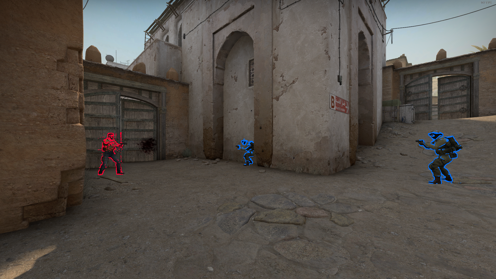

# Deep Learning Aim Assistance

## Requirements

- CMake 3.17.3 (Probably works on earlier versions too)
- Visual Studio 2019/22
- OpenCV 4.5.5 (C++)
  - Compiled with GPU support (Recommended)
- Windows
- CLion (Optional for easier building/running)

## Building

Manually:

1. `mkdir build`
2. `cd build`
3. `cmake ..`
4. Open .sln in Visual Studio
5. Build all
6. Run

CLion:

1. Open project in CLion
2. Setup Visual Studio 2019/22 toolchain
3. Right click CMakeLists.txt
   1. Import/Reload CMake Project
4. Run

## Configuration

By default the application builds to use the `model_640.onnx` file as that is the most 
accurate and fastest to run. Check `/include/detector.h` for swapping to the higher input
resolution model, this will require changing `INPUT_WIDTH`, `INPUT_HEIGHT`, and `ROWS` to 
ensure proper loading and detections.

## Running

1. Ensure `config` folder with models are next to built application
2. `deeplearning.exe <name_of_program_to_capture>`
   1. e.g `deeplearning.exe Counter`

## Example

